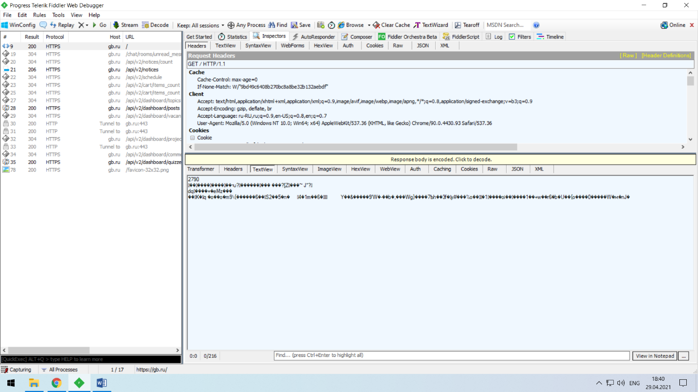
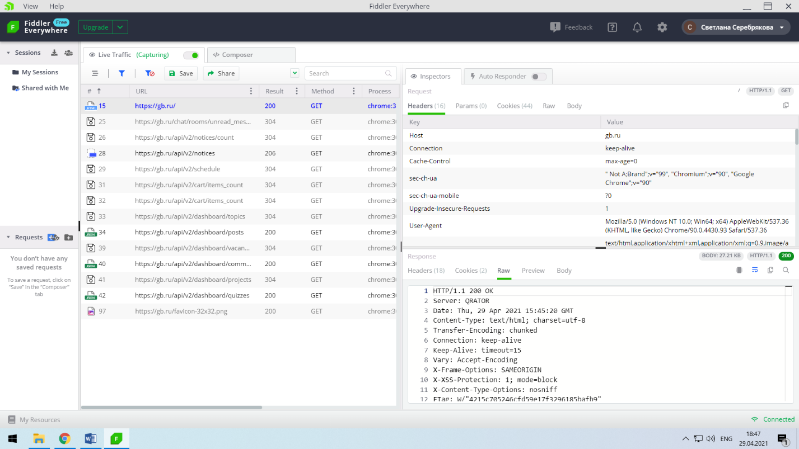
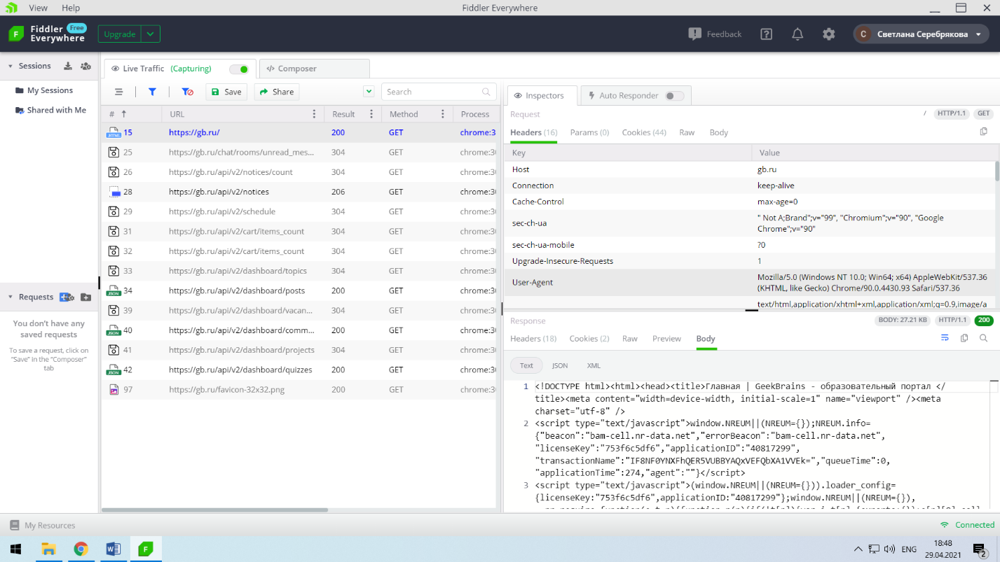

# Установила обе версии Fiddler - Fiddler Classic и Fiddler Everywhere.
## В списке запросов выбрала изначальный HTTP-запрос на открытие страницы и ответ.

## Декодировала ответ.

## User agent отправляемый в запросе.
User agent  - Mozilla/5.0 (Windows NT 10.0; Win64; x64) AppleWebKit/537.36 (KHTML, like Gecko) Chrome/90.0.4430.93 Safari/537.36

## Тип содержимого ответа и тип кодировки.
Тип содержимого – HTML-страница или text/html; тип кодировки - charset=utf-8.

